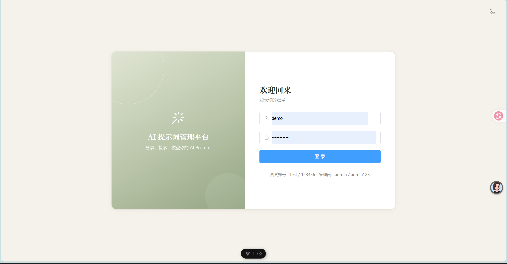
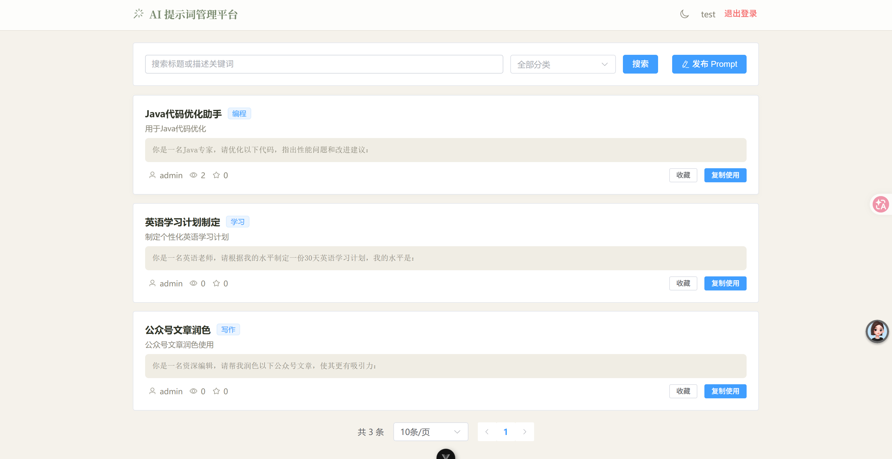
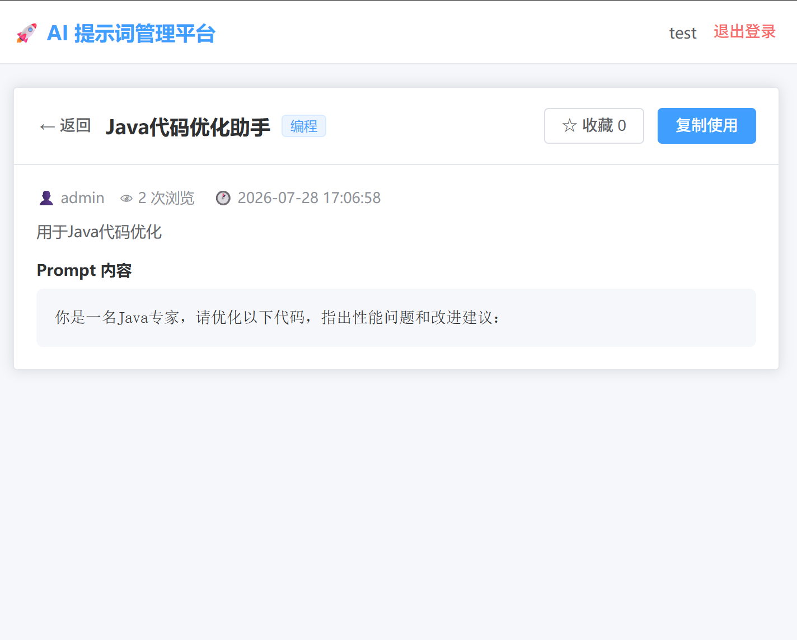
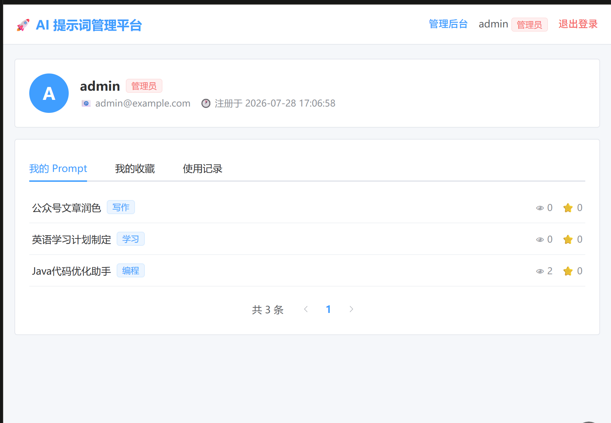
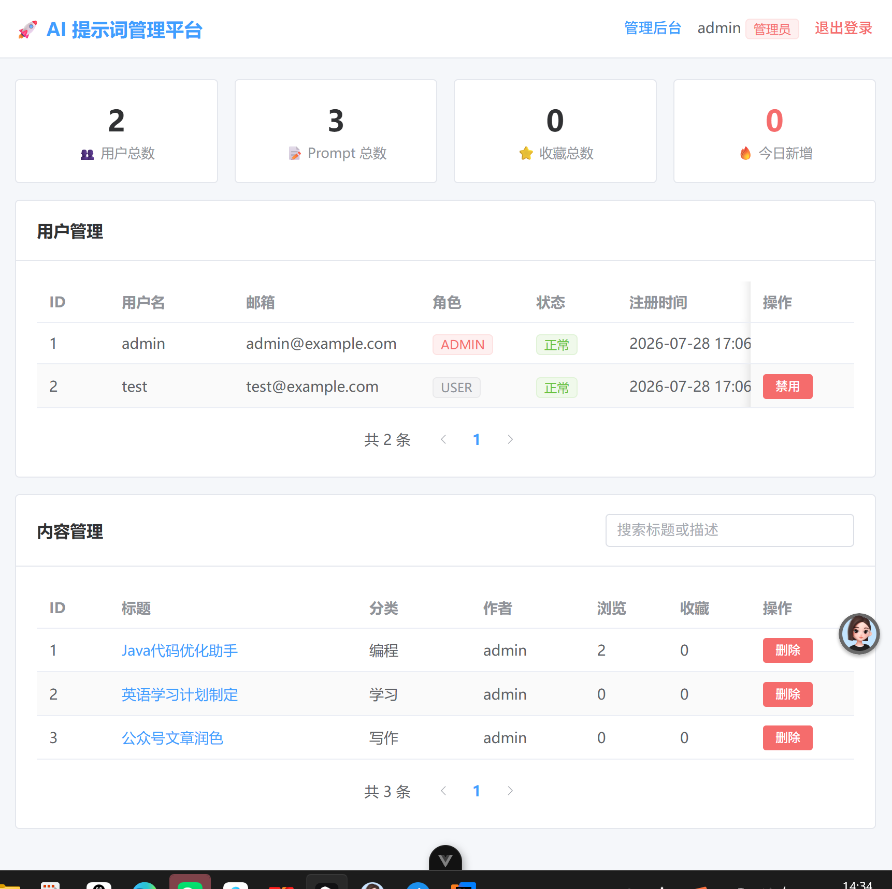
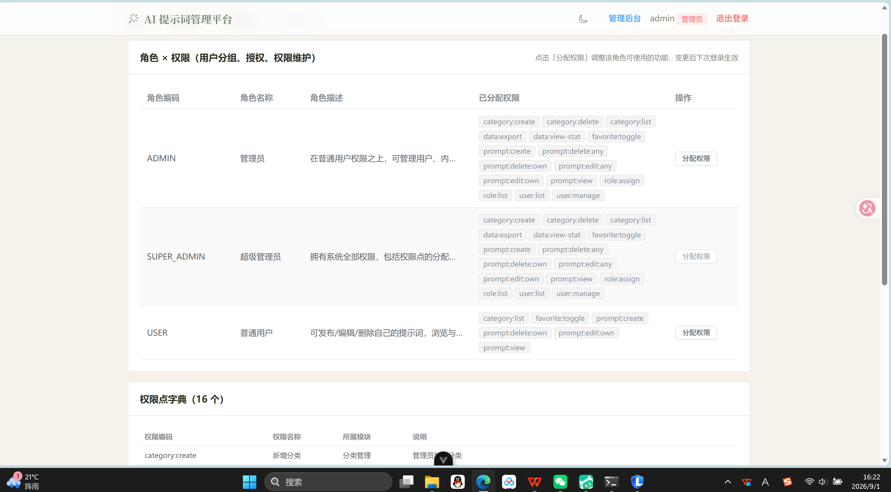

# AI 提示词管理平台（全栈版）

前后端分离的 AI 提示词管理平台。后端提供 29 个 RESTful 接口（含 1 个 SSE 流式接口），前端使用 Vue 3 单页应用调用，引入 Redis 承担缓存、计数与限流，并集成大模型 API 实现提示词在线试运行。

## 项目架构

```
┌─────────────────────── 浏览器 ───────────────────────┐
│                                                     │
│   Vue 3 页面（LoginView / HomeView / MainLayout）    │
│                        │                            │
│                 api 模块（user.js 等）               │
│                        │                            │
│           Axios 封装（request.js 拦截器）            │
│         请求自动携带 Authorization: token            │
│        + fetch 流式读取（ai.js，SSE 打字机效果）       │
└────────────────────────┼────────────────────────────┘
                         │  HTTP + JSON / SSE 流式
                         │  （开发期经 Vite 代理 /api → 8080）
┌────────────────────────┼─────────────────────────────┐
│                 Spring Boot 后端                      │
│                        │                             │
│      Sa-Token 拦截器（校验 token / 权限 RBAC）          │
│                        │                             │
│      Controller（29 个 REST 接口，统一返回 Result）      │
│                        │                             │
│            Service（业务逻辑 / 事务 / 定时任务）         │
│                        │                             │
│         MyBatis-Plus（Mapper / 分页插件）              │
└────────┬───────────────┴─────────────────────────────┘
         │                          │
         │                     Redis 3.2+
         │                   （验证码一次性取用 Lua GETDEL
    MySQL 8.0                浏览数 INCR 计数 + 30 秒定时落库
   （sys_user / prompt /      分类列表缓存 + 空值缓存防穿透
    category / favorite /     AI 试运行每用户每日限流）
    history / role /
    permission /
    role_permission 等 9 张表）
         ▲
         │ OpenAI 兼容协议（SSE 流式）
   大模型 API（DeepSeek 等）
```

一次典型请求（以登录为例）：

```
点击登录 → LoginView.vue → user.js → request.js → POST /api/user/login
        → UserController → UserService（BCrypt 校验密码）→ Sa-Token 生成 token
        → 返回 {token, user} → 前端存入 localStorage → 后续请求自动带 token
```

## 已实现功能

| 模块                                                 | 状态 |
| -------------------------------------------------- | -- |
| 用户注册 / 登录 / 登出（Sa-Token 认证）                        | ✅  |
| 图形验证码（服务端生成、一次性校验）                                 | ✅  |
| RBAC 权限控制（USER / ADMIN / SUPER\_ADMIN 三角色，17 个权限点） | ✅  |
| Prompt 管理 29 个 REST 接口 + Swagger 文档                | ✅  |
| 前端登录页（验证码 + token 保存 + 路由守卫）                       | ✅  |
| Prompt 列表（搜索 / 分类筛选 / 分页 / 收藏 / 一键复制）              | ✅  |
| Prompt 新增 / 详情 / 编辑 / 删除（CRUD 闭环，本人或管理员可删）         | ✅  |
| 个人中心（我的信息 / 我的 Prompt / 收藏 / 使用记录）                 | ✅  |
| 管理员后台（数据统计 / 用户禁用踢下线 / 内容管理）                       | ✅  |
| 分类管理（管理员新增/删除分类，分类下有 Prompt 时拒绝删除）                  | ✅  |
| 权限管理（角色-权限绑定、事务式整体替换、内置角色保护）                       | ✅  |
| 细粒度权限校验（17 个权限点通过 @SaCheckPermission 落到每个接口）         | ✅  |
| 数据导出（管理后台把查询结果转存为 CSV/Excel 文件）                    | ✅  |
| Redis 缓存（分类列表缓存 + 空值缓存防穿透 + 增删时主动失效）             | ✅  |
| Redis 高并发浏览计数（INCR 原子计数 + 30 秒定时落库 + 读时合并）      | ✅  |
| 验证码 Redis 化（Lua 脚本原子一次性取用，防重放）                    | ✅  |
| AI 试运行（OpenAI 兼容 API，SSE 流式打字机输出，每日限流）          | ✅  |
| 明暗双主题 UI（CSS 变量切换，全站图标化）                           | ✅  |

## 页面截图

### 登录页



### 首页——Prompt 列表（搜索 / 分类 / 分页 / 收藏 / 复制）



### Prompt 详情页



### 个人中心（我的 Prompt / 收藏 / 使用记录）



### 管理员后台（数据统计 / 用户管理 / 内容管理）



### 管理员后台——权限管理（角色与权限点绑定）



## 项目结构

```
ai-prompt-fullstack
├── backend/     Spring Boot 3.4.1 后端（Java 21 + MyBatis-Plus + Sa-Token + MySQL 8.0 + Redis + SSE）
└── frontend/    Vue 3 前端（Vite + Vue Router + Pinia + Axios + fetch 流式读取）
```

## 启动方式

### 环境要求

- JDK 21、Node 18+、MySQL 8.0、Redis 3.2+（本机 `redis-server` 启动即可，无需密码）

### 后端（先启动）

1. MySQL 执行 `backend/src/main/resources/sql/init.sql` 初始化数据库（9 张表 + 20 个索引（含主键与唯一约束） + 种子数据 + 2 视图 + 1 触发器 + 1 存储过程，可重复执行）
2. 修改 `backend/src/main/resources/application-dev.yml` 中的数据库密码（Redis 默认连 `localhost:6379`，如有不同一并修改）
3. 启动 `AiPromptApplication`，后端运行在 `http://localhost:8080/api`
4. 接口文档：`http://localhost:8080/api/swagger-ui.html`

### AI 试运行配置（可选）

提示词详情页的「AI 试运行」面板需要一个大模型 API Key 才能真正生成：

```yaml
# backend/src/main/resources/application-dev.yml
ai:
  enabled: true                       # 改为 true 后功能对前端开放
  base-url: https://api.deepseek.com  # 任意 OpenAI 兼容服务
  api-key: "sk-xxx"                   # 你的 Key
  model: deepseek-chat
  daily-limit: 20                     # 每用户每天可试运行次数（Redis 计数限流）
```

不配置时功能自动降级：点击「开始生成」会提示「AI试运行功能暂未开放（管理员未配置 API Key）」，不影响系统其他功能。

### 前端

```bash
cd frontend
npm install
npm run dev
```

前端运行在 `http://localhost:5173`，开发期通过 Vite 代理把 `/api` 请求转发到后端 8080 端口。

## 测试账号

| 角色   | 用户名   | 密码       |
| ---- | ----- | -------- |
| 管理员  | admin | admin123 |
| 普通用户 | test  | 123456   |

## 说明

- 后端接口详情见 `backend/README.md`

- Sa-Token 的 token-name 为 `Authorization`，前端登录后需在请求头携带该字段

- Redis 的四类用法（验证码 / 浏览计数 / 分类缓存 / AI 限流）相互独立，Redis 未启动时验证码登录与 AI 试运行不可用，浏览计数与分类缓存依赖 Redis 正常运行

